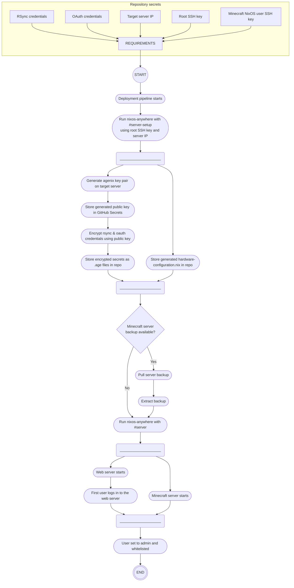

```mermaid
flowchart TD
    subgraph Repository secrets
        1[RSync credentials] --> REQUIREMENTS
        2[OAuth credentials] --> REQUIREMENTS
        3[Target server IP] --> REQUIREMENTS
        4[Root SSH key] --> REQUIREMENTS
        5[Minecraft NixOS user SSH key] --> REQUIREMENTS
    end

    REQUIREMENTS --> START

    START((START)) --> A
    A([Deployment pipeline starts])
    A --> B([Run nixos-anywhere with #server-setup<br>using root SSH key and server IP])

    B --> P1(____________________)

    P1 --> C1([Generate agenix key pair on target server])
    P1 --> C2([Store generated hardware-configuration.nix in repo])
    C1 --> D([Store generated public key in GitHub Secrets])
    D --> E([Encrypt rsync & oauth credentials using public key])
    E --> F([Store encrypted secrets as .age files in repo])

    F --> P2(____________________)
    C2 --> P2

    P2 --> D1{Minecraft server<br>backup available?}

    D1 -- Yes --> G([Pull server backup])
    D1 -- No --> I
    G --> H([Extract backup])
    H --> I([Run nixos-anywhere with #server])

    I --> P3(____________________)
    
    P3 --> J1([Web server starts])
    P3 --> J2([Minecraft server starts])
    J1 --> K([First user logs in to the web server])
    K --> P4(____________________)
    
    J2 --> P4

    P4 --> L([User set to admin and whitelisted])

    L --> END(((END)))
```